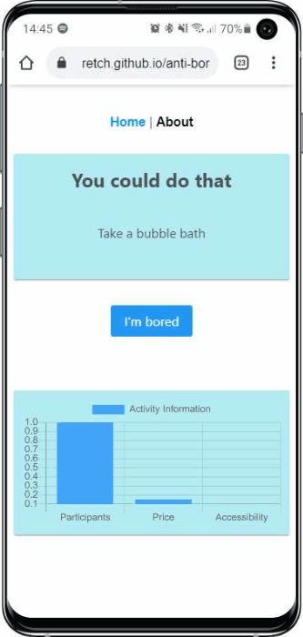

# anti-boredom

[](https://github.com/Retch/anti-boredom/actions?query=workflow%3ABuild)
[](https://retch.github.io/anti-boredom/)

## Project setup

```
npm install
```

### Compiles and hot-reloads for development

```
npm run serve
```

### Compiles and minifies for production

```
npm run build
```
<br>

[](https://retch.github.io/anti-boredom/)
